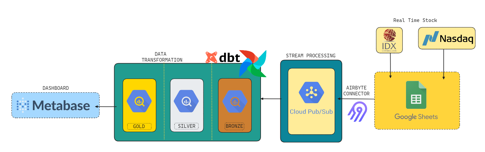
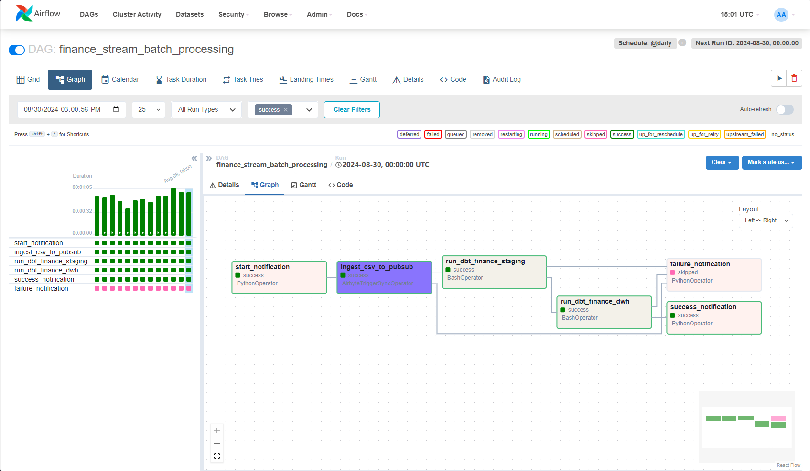
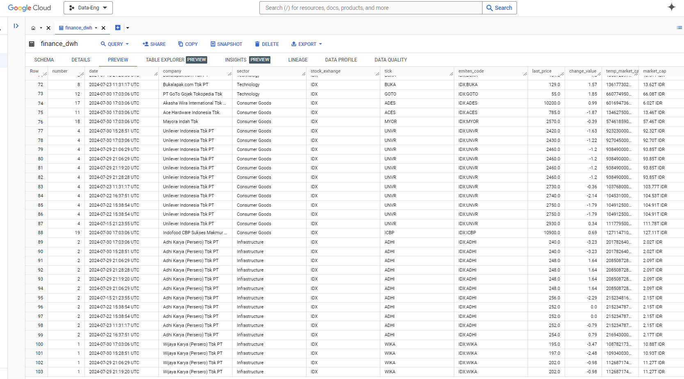
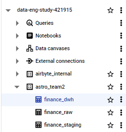
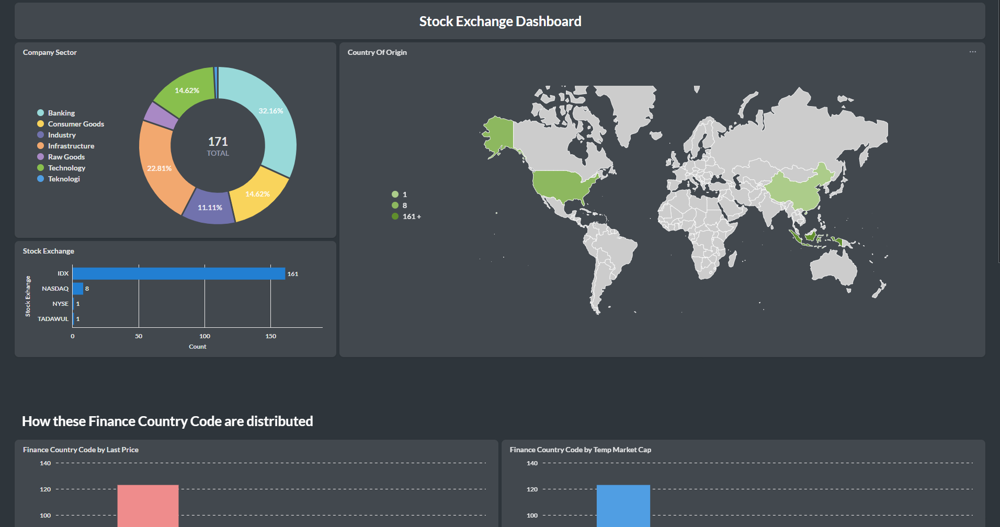

### Project ETL Stock IDX - Stream Processing

> End-to-end data pipeline with Extract-Load-Transform concept

- **Data Stack**
  - Orchestration = Apache Airlow
  - Connector = Airbyte
  - Data Transformation = dbt
  - OLAP/Data Warehouse = Google BigQuery
  - Stream Processing = Google Pub/Sub


#### A. System Design


#### B. Airflow Graph


#### C. BigQuery Data Warehouse



#### D. Temporary Dashboard (soon to be updated)


#### E. Discord Notification Webhook Integration
1. Airflow Dashboard -> Admin -> Add Variables

OR with CLI

```bash
airflow variables set DISCORD_SUCCESS_WEBHOOK_URL "https://discord.com/api/webhooks/xxxxx"
airflow variables set DISCORD_FAILURE_WEBHOOK_URL "https://discord.com/api/webhooks/xxxxx"
```

2. Add to DAG

```py
DISCORD_SUCCESS_WEBHOOK_URL = Variable.get("DISCORD_SUCCESS_WEBHOOK_URL")
DISCORD_FAILURE_WEBHOOK_URL = Variable.get("DISCORD_FAILURE_WEBHOOK_URL")
```

